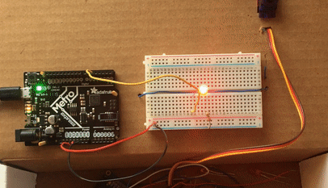
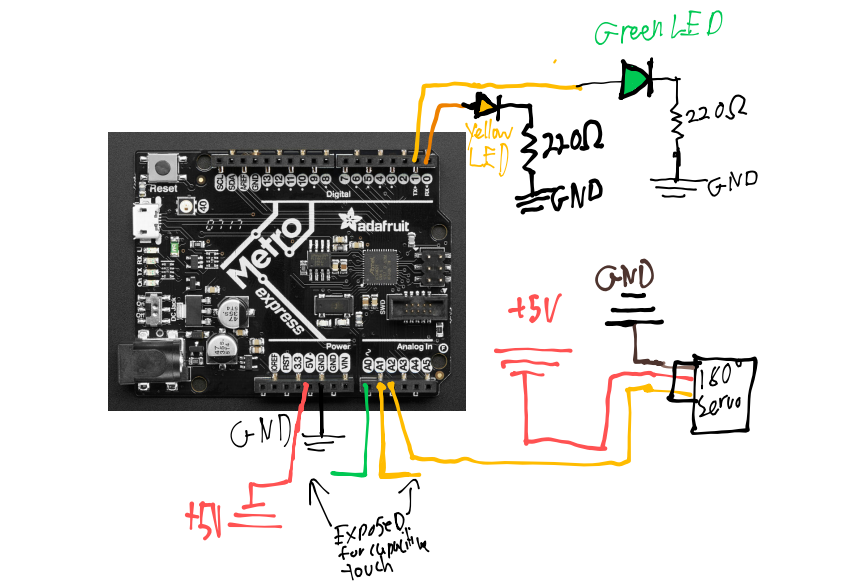
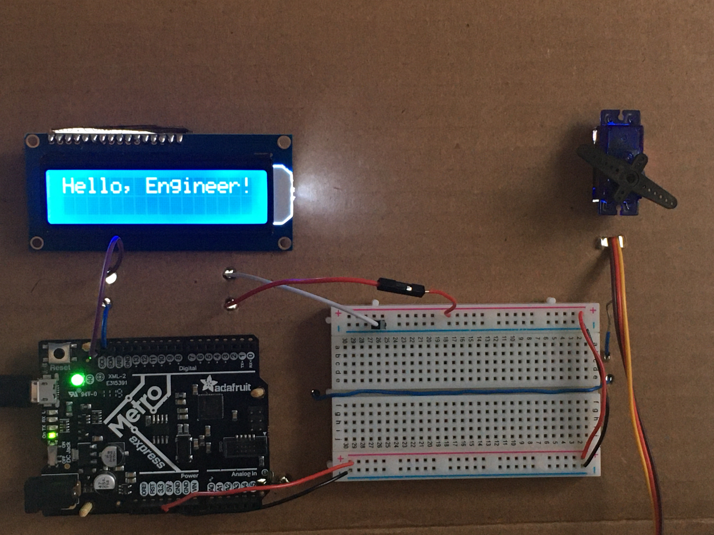

# CircuitPython
My circuit python assignments

[Markdown Cheatsheet](https://www.markdownguide.org/cheat-sheet/)

> blockquote

`In-line Code`

```python
code block here
```
# Table of Contents

[Table of Contents](#Table-of-Contents)

* [helloCircuitPython](#helloCircuitPython)
  * [Description](#description)
  * [Process](#Process)
  * [Evidence](#Evidence)
  * [Reflection](#Reflection)
* [circuitPythonServo](#circuitPythonServo)
  * [Description](#Description-1)
  * [Process](#Process-1)
  * [Evidence](#Evidence-1)
  * [Reflection](#Reflection-1)
* [circuitPythonLCD](#circuitPythonLCD)
  * [Description](#Description-2)
  * [Process](#Process-2)
  * [Evidence](#Evidence-2)
  * [Reflection](#Reflection-2)


## helloCircuitPython
*[Back to Table of Contents](#Table-of-Contents)*

**Sub-Table of Contents:**

 * [Description](#description)
 * [Process](#Process)
 * [Evidence](#Evidence)
 * [Reflection](#Reflection)

### Description

*[Back to Sub-Table of Contents](#helloCircuitPython)*

> This year, we are going to be programming Metro Express boards using CircuitPython.

### Process

*[Back to Sub-Table of Contents](#helloCircuitPython)*


Go to [this link](https://learn.adafruit.com/welcome-to-circuitpython) and click the green buttons at the end of the first text box. Read through the tutorial to learn how to boot the Metro 0 and turn it into a F:CIRCUITPY drive

Once it's like that, you need to save ur code file as `main.py` to the board. In order to update the file on Github, put each assignment in github in it's own folder with the file name. 

Ok i need to install lib

search for the `neopixel.mpy`and add it into the lib folder on the metro express.

alrighty I think that's all I need to do. Let's get started w/ the coding! 

Install [Mu](https://codewith.mu/en/download), and also I like using [Typora](https://typora.io/) for editing my readme locally.

And just upload the code in the assignment page.

### Evidence

*[Back to Sub-Table of Contents](#helloCircuitPython)*

We are literally given the code and there is no wiring. So take it on faith that if I got the next assignment done, I got this one done as well ;)

```python
import board
import neopixel

dot = neopixel.NeoPixel(board.NEOPIXEL, 1)

print("Make it red!")

while True:
     dot.fill((255,0,0))
```

### Reflection

*[Back to Sub-Table of Contents](#helloCircuitPython)*

I quite like how the metro express loads like a flash drive that you just save files too. Python is also just way more streamlined than arduino.

---


## circuitPythonServo
*[Back to Table of Contents](#Table-of-Contents)*

**Sub-Table of Contents:**

  * [Description](#description-1)
  * [Process](#Process-1)
  * [Evidence](#Evidence-1)
  * [Reflection](#Reflection-1)

### Description
*[Back to Sub-Table of Contents](#circuitPythonServo)*
Now it's time to control a servo with a circuit python

[The Assignment Page](https://cvilleschools.instructure.com/courses/31071/assignments/300471?module_item_id=1016569)

>Last year, whether you knew it or not, when you were sending signals to servos to make them move, you were using PWM, or Pulse Width Modulation.  With PWM, you encode information by modulating the width of a electronic pulse.  In other words, you  send a bunch of pulses to your servo and the width of those pulses is what the servo interprets as a message.
>In CircuitPython, when you make a PWM object, you specify the duty cycle (which can be changed) and frequency.  Frequency is just how often the pulses occur.  Notice in the picture above that all of the square pulses start at the same time, meaning they have the same frequency.  Duty cycle determines how long the pulses stay high.  In CircuitPython, the duty cycle is a number between 0, which is 0% and 216 (65,536), which is 100%.

This all means absolutely noting to y'all tho (yet), so I'll jump to the assignment description

>Get a 180° micro servo to slowly sweep back and forth between 0 and 180°.
>
>The spicy part (FYI: "spicy" means "fun", "extra spicy" means "really fun, but optional") : stick two random wires into two of the Analog In pins on your Metro.  Use those two wires and the magic of capacitive touch to control the servo.  Touch one wire and the servo goes one way.  Touch the other wire and it goes the other way.  The servo only moves if you're touching a wire.
>
>I don't expect you know know how to program capacitive touch on your Metro.  That's what Google is for.  But please don't Google "how to make a servo move using capacitive touch."  I hope you will improve your Google-fu in this class.  Break down what you need to know.  Maybe start with "Metro express capacitive touch" , or "CircuitPython capacitive touch" or something like that.
>
>When you're done, upload your code, document your work in your repo README, and submit your repo URL.  Additionally, you should upload a short video to Canvas, showing the thing working.  Use the record option when submitting, it's really easy. 

Big Hint:

>Make sure you have downloaded the appropriate [Adafruit CircuitPython library bundle](https://github.com/adafruit/Adafruit_CircuitPython_Bundle/releases/)  So, if you're running version 5.x of CircuitPython, grab the 5.x bundle.  Inside the bundle, you'll find a "lib" folder and inside that you'll find an "adafruit_motor" folder.  Inside that, you'll find the "servo.mpy" library.  Copy that file to the lib folder on your Metro and you can use Adafruit's amazing servo object!  In other words, you can say stuff like `myServo.angle = 90` instead of having to figure out PWM communication.

### Process

*[Back to Sub-Table of Contents](#circuitPythonServo)*

***Note:*** *This describes how I went about doing the assignment. There's a segment where I'm trying to get an LED to fade, because I thought it'd also work to make the servo sweep. If you want to skip to where I actually start getting the servo to sweep, click [here.](#Actually-Getting-the-Servo-Working) However reading the other stuff might be helpful, It's not necessary for the assignment.*

Ok, so first off, I'm gonna approach it like how I would an Arduino:

1. I need to figure out how to 'attach' the servo to a pin
2. How to write a value to the pin

Python is an object-based programming language, so I just have to make an object and connect that to the pin.

Basically, my first question is how do I tell it which pin to use?

Ok, so for this one, the `d` next to the number means it's a digital pin


So, I'm a bit off-topic now, but I think I can just start with an LED, and it'll work with the servo

Here's some code that I stole from [Adafruit.](https://learn.adafruit.com/adafruit-metro-m0-express-designed-for-circuitpython/circuitpython-pwm)

```python
import time
import board
import pulseio
 
led = pulseio.PWMOut(board.D5, frequency=5000, duty_cycle=0)
 
while True:
    for i in range(100):
        # PWM LED up and down
        if i < 50:
            led.duty_cycle = int(i * 2 * 65535 / 100)  # Up
        else:
            led.duty_cycle = 65535 - int((i - 50) * 2 * 65535 / 100)  # Down
        time.sleep(0.01)
```

It's quite cool what they are doing here. The pin actually cannot be truly analog, so they use PWM to make it appear analog. 

Let's see what it looks like on the Metro:

[](circuitPythonServo/PWMTestWLED.gif)

Sick gif dude

I think it'll just work if I now plug in the servo

Actually, I'm gonna slow down the cycle speed first

Well that was a waste; it doesn't work. Let's try something else.

#### Actually Getting the Servo Working

So we're going somewhere else entirely! [Here's the rad Adafruit page I found.](https://learn.adafruit.com/adafruit-metro-m0-express-designed-for-circuitpython/circuitpython-servo)

And here's the code they're giving me to upload:

```python
import time
import board
import pulseio
from adafruit_motor import servo
 
# create a PWMOut object on Pin A2.
pwm = pulseio.PWMOut(board.A2, duty_cycle=2 ** 15, frequency=50)
 
# Create a servo object, my_servo.
my_servo = servo.Servo(pwm)
 
while True:
    for angle in range(0, 180, 5):  
        # 0 - 180 degrees, 5 degrees at a time.
        my_servo.angle = angle
        time.sleep(0.05)
    for angle in range(180, 0, -5):
        # 180 - 0 degrees, 5 degrees at a time.
        my_servo.angle = angle
        time.sleep(0.05)
```

Wow, look at those `for` loops. They are very simple. So how it works, I'm guessing, is that the for loop starts the variable `angle` at 0, then increments up by 5 and writes that to the angle portion of the `my_servo` object, so it actually knows what to do with that number. Huh ok then. Well let's run it on the metro then.

My servo is quite shaky, let me try and just have it change positions

```python
import time
import board
import pulseio
from adafruit_motor import servo

# create a PWMOut object on Pin A2.
pwm = pulseio.PWMOut(board.A2, duty_cycle=2 ** 15, frequency=50)

# Create a servo object, my_servo.
my_servo = servo.Servo(pwm)

while True:
    my_servo.angle = 0
    time.sleep(.5)
    my_servo.angle = 10
    time.sleep(1)
```

Ok so it's a problem with the code because that worked perfectly 

Let's make it go faster and pause at the end.

After messing with some variables, the settings that ended up working the best were the time.sleep being .01 and the angle being 5


And then capacitive touch is actually pretty simple. A quick Google got me [this code:](circuitPythonServo/CapacitiveTouch.py) 

```python
# Capacitive Touch Code
# From: https://learn.adafruit.com/adafruit-metro-m0-express-designed-for-circuitpython/circuitpython-cap-touch
#
import time

import board
import touchio

touch_pad_green = board.A0  # Will not work for Circuit Playground Express!
touch_pad_yellow = board.A1
# touch_pad = board.A1  # For Circuit Playground Express

touchGreen = touchio.TouchIn(touch_pad_green)
touchYellow = touchio.TouchIn(touch_pad_yellow)

while True:
    if touchGreen.value and not(pastGreen):
        print("Touched Green!")
    if touchYellow.value and not(pastYellow):
        print("Touched Yellow!")
    pastGreen = touchGreen.value
    pastYellow = touchYellow.value
    time.sleep(0.05)
```

I was having trouble with getting all of my `bool`s to actually work properly. I saw that python was a dynamic language, so I didn't have to initialize my variables? Well, I looked it up, and that's wrong. If you don't want a value on the variable, just do this:
```python
var = None
```
EZ.

Also, it's `True`, `and`, `False`, and `not`, and NOT `true`, `&&`, `false`, and `!`. Syntax matters.

### Evidence

*[Back to Sub-Table of Contents](#circuitPythonServo)*

[Here's](circuitPythonServo/final1.py) the finalized code. 

Here's the wiring diagram. Click on it to go to it.

[](circuitPythonServo/wiring.png)

[](circuitPythonServo/finalCodeWorking.gif)

### Reflection

---

*[Back to Sub-Table of Contents](#circuitPythonServo)*

I definitely went all out with this assignment. But also all of the documentation I did should make later projects so easy because I have all of the code I need already. It's also cool how I didn't need to touch the exposed copper for it to register as touched. Cool thing about capacitors, they don't touch, and that's why they have the properties that they do.

-----

## circuitPythonLCD

*[Back to Table of Contents](#Table-of-Contents)*

**Sub-Table of Contents:**

 * [Description](#Description-2)
* [Process](#Process-2)
* [Evidence](#Evidence-2)
* [Reflection](#Reflection-2)

### Description

WIP

*[Back to Sub-Table of Contents](#circuitPythonLCD)*

> Remember that assignment from Engineering 2 where you wired up an LCD screen, a button, and a switch?  The LCD screen displayed the button press count and the switch determined if you were counting up or down.  Let's see if we can spice that up a little for Engineering 3 using CircuitPython.

### Process

*[Back to Sub-Table of Contents](#circuitPythonLCD)*

First, to get the LCD wired up and working.

The wiring is made easy due to the LCD Backpack: GND to GND, VCC to 5V, SDA to SDA, and SCL to SCL.

Go [here](https://cvilleschools.instructure.com/courses/31071/assignments/303469) to the assignment page on canvas for the libraries to put in your metro.

And with that all squared away, the [following code](circuitPythonLCD/LCDTestCode.py) should work:

```python
from lcd.lcd import LCD
from lcd.i2c_pcf8574_interface import I2CPCF8574Interface
# some LCDs are 0x3f... some are 0x27.
lcd = LCD(I2CPCF8574Interface(0x3f), num_rows=2, num_cols=16)

lcd.print("Hello, Engineer!")
```
And here's it working:
[](circuitPythonLCD/LCDTestWorking.JPG)

Alright, let's now work in a button or two!!

The LCD functions are different this time around: it's `lcd.set_cursor_pos(y[0-1],x[0-15])` instead of `lcd.set`

Ok so now we're running into a memory issue. The circuit python can only hold so much stuff at a time, so we need to make sure we're saving as much space as possible. Mr. H said to delete any libraries that we are not using off of the circuit python. I forsee that becoming an issue when I have to go back and find any of the libraries I included and making sure they're all updated... oh well.  I guess I can always just google search for them.

Still having memory issues? Apparently you have to convert the files, but that seems to be a massive pain to do. Once I have the library folders, I'll link them here.

Until then, let's limit the amount of characters we're printing to the LCD.

And now another error that I not understand. YAY

```
Traceback (most recent call last):
  File "main.py", line 15, in <module>
  File "/lib/lcd/i2c_pcf8574_interface.py", line 52, in __init__
RuntimeError: SDA or SCL needs a pull up
```

...It just wasn't plugged in lol

Ok back to memory problems ugh

My fix was inspired by [Alden](https://github.com/adent11/CircuitPython#CircuitPython-LCD), and it was that I need to limit the number of different characters that I'm uploading to the LCD. I had a "Hello Engineer!" on startup; I'm guessing that was the cause of things not working.

### Evidence

*[Back to Sub-Table of Contents](#circuitPythonLCD)*

### Reflection

*[Back to Sub-Table of Contents](#circuitPythonLCD)*

